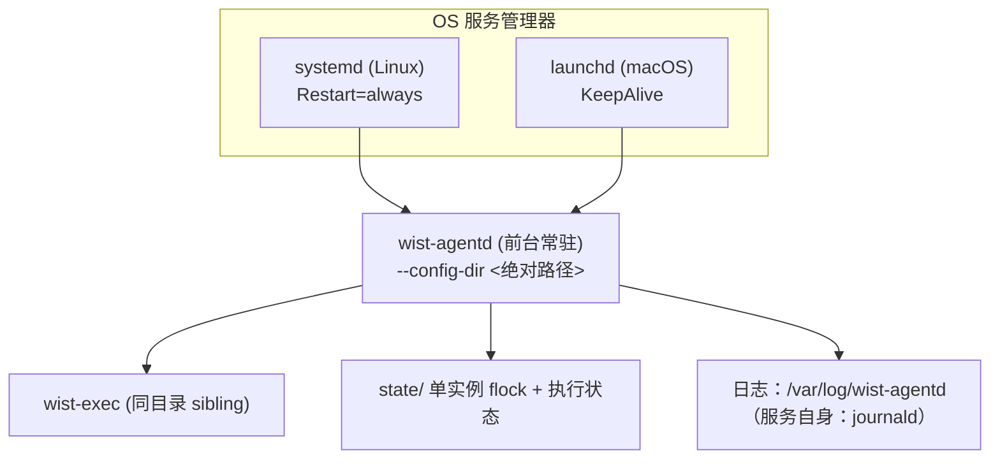

# wist-agentd macOS / Linux 后台长期运行方案（设计说明）

本文说明**为什么**这样让 `wist-agentd` 长期后台运行。具体命令、安装位置表、升级步骤、排障表在
[安装与使用手册](./agentd-install-and-usage.md)，本文不重复。

- 相关代码：[`src/service/`](../src/service)、[`src/single_instance.rs`](../src/single_instance.rs)、
  [`src/runtime/steady_log.rs`](../src/runtime/steady_log.rs)
- 相关文档：[agentd-architecture.md](./agentd-architecture.md)、[agentd-failure-handling.md](./agentd-failure-handling.md)

---

## 1. 目标与非目标

| 目标 | 落地手段 |
| --- | --- |
| 关掉终端、退出登录后仍运行 | 交给 OS 服务管理器（Linux systemd / macOS launchd）托管 |
| 开机自启 | systemd `enable`；launchd `RunAtLoad` + `LaunchDaemons`/`LaunchAgents` |
| 崩溃自动拉起 | systemd `Restart=always`；launchd `KeepAlive` |
| 长期运行不撑爆磁盘 | 稳态日志收敛 + journald / newsyslog 轮转 |
| 长期运行不出现重复实例 | state 目录 `flock` 单实例锁（进程退出即自动释放） |
| 配置 / 数据 / 日志分离 | 配置在 `/etc/wist-agentd`，数据（含采集输出 `data/`）落 `/var/lib/wist-agentd`，日志落 `/var/log/wist-agentd`（FHS） |
| 可升级、可回滚 | 原地替换二进制 + 重启服务；执行中的计划由 crash recovery 承接 |
| 验收可重复 | `sysrun/verify-system-install.sh`（需 root 的一次性验收机）自动断言定义/自启/running/落点/采集输出/拉起/单实例 |

**非目标（本方案不做）**：

- 不做 `fork` / `double-fork` daemonize。前台运行是服务管理器的前提，也避免了“谁持有 PID”的歧义。
- 不代替 `sysrun/start.sh`。`sysrun/` 仍是**开发机联调**脚本（`&` + `disown` + pidfile）；
  生产常驻一律走 `service install`。
- 不创建专用系统账号、不装 root helper。需要提权采集（audit / TCC / 统一日志）时，
  按 [macos-agent-uplink-to-warp-parse.md](./macos-agent-uplink-to-warp-parse.md) 的 root helper 方案另议。

## 2. 总体设计

三条硬约束：

1. **前台运行**：`ExecStart` / `ProgramArguments` 直接指向 `wist-agentd`，不加 daemonize 参数。
2. **配置目录必须绝对**：服务启动时 CWD 不确定，`--config-dir` 在安装时即被解析成绝对路径写进定义文件；
   配置文件内的 `[paths]` 相对路径一律相对**配置文件所在目录**解析（`resolve_paths`）。
3. **`wist-exec` 与 `wist-agentd` 同目录**：守护进程优先按“可执行文件同目录 sibling”解析执行器；
   安装时会检查并告警，也可用 `WARP_INSIGHT_EXEC_BIN` 覆盖。

### 两种安装方式与设计的关系

安装方式只影响“**由谁发起、放哪里、以谁运行**”，机制完全共用：

| | 开发环境安装（手册 §2） | 通过 Wist-Gateway 安装（手册 §3，TODO） |
| --- | --- | --- |
| 发起方 | 工程师手工执行 | 控制面下发安装指令（含 endpoint + 一次性 token） |
| 目录落点 | 全部就地（配置/数据/日志在同一个目录） | 配置 `/etc`、数据 `/var/lib`、日志 `/var/log`（第 5 节） |
| 运行身份 | 当前用户（`--user` 或不装服务） | root（系统级 systemd / launchd） |
| 注册 | 可选；`enroll --token` 一次性传入 | `service install --enrollment-token`，token 不落盘 |
| 日志采集 | `journalctl --user` / `~/Library/Logs/wist-agentd` | journald / `/var/log/wist-agentd` |

共用机制：`service install`（渲染 + 落盘 + 激活）、命令行一次性注册、路径推导、flock 单实例。
网关安装只是把这一串手工步骤搬进安装脚本，因此 agent 侧的能力已就位（见手册 §3.2）。

## 3. 关键取舍

**为什么不自带 daemonize。** 常驻托管有两条路：自己 `fork` 脱离终端（传统 daemon），或前台运行交给
supervisor。后者让“谁在管、怎么重启、日志去哪”都有唯一答案，也避免了 `fork` 之后 PID/日志/信号
处理的常见坑；`sysrun/start.sh` 那种 `&` + `disown` 只是开发机权宜。

**为什么用 flock 而不是 pidfile 判重复。** pidfile 有“stale 文件要清理、PID 被复用误判”的问题；
`flock` 挂在打开的文件描述符上，进程退出（含 `kill -9`）即由内核释放，覆盖 `start.sh`、`--foreground`、
直接运行二进制、supervisor 拉起等所有入口。副作用是“服务管理器重启期间若前任未退出，新进程会快速失败”,
这正是 `RestartSec` / `StartLimitBurst`（systemd）与 `ThrottleInterval`（launchd）要限流的原因。

**为什么 `service install` 只做两件事。** 渲染定义 → 落盘（+ 建 launchd 日志目录），服务管理器调用
单独一步、可 `--no-activate` 跳过。这样：单测只覆盖“可确定的部分”（文本与文件），发行包/配置管理
工具可以只取 `service print --for` 的产物自己分发，不需要在安装机上执行二进制。

**为什么主循环是 3s（`TICK_INTERVAL`）。** 每轮都要重算并落盘派生状态（指标快照、`state/export/*.jsonl`、
`agent_runtime`）并扫描 `state/`，所以 tick 周期**直接等于稳态磁盘动作频率**：3s 一轮即 ≈3 次写盘 ×
2.88 万轮/天 ≈ 8.6 万次/天。它换来的是“采样延迟”而不是“吞吐”——`drain` 每轮只处理一个队列项且等它
跑完，该值不是执行吞吐上限。

边界：更快的 tick 只增加写盘次数，换不到可感知的收益（file 输入本就是秒级时效）；慢于 5s 才开始拖
采集延迟。判断依据是“负载是否真有亚秒级时效要求”——采集（file tail）没有，将来的近实时场景单独议。
副作用见第 7 节第 6 条。

**为什么日志必须收敛。** 见第 4 节：不收敛的话，磁盘会被固定频率的输出吃满。

## 4. 日志：为什么必须收敛

常驻主循环周期 3s（`src/runtime/daemon.rs` 的 `TICK_INTERVAL`），每轮产出健康快照与指标快照。若逐轮打印：

- 健康快照：`health` + `metrics_runtime` + 每个 discovery probe 一行（默认 4 个探针）= 6 行/轮
- 指标快照：`event=MetricsRuntimeUpdated` 1 行/轮

即 **≈2.3 行/秒 ≈ 20 万行/天**（按 200B/行 ≈ 40 MB/天 ≈ 14 GB/年）——与“有没有变化”无关的固定频率写入，
时间一长仍必须靠日志轮转兜底。因此 `src/runtime/steady_log.rs` 对这两路**周期快照**做“签名去重 + 心跳”：

| 行为 | 说明 |
| --- | --- |
| 内容变化 | 立即打印（状态迁移、队列/running/reporting 变化、探针状态/计数变化、指标失败等） |
| 内容不变 | 每 `WIST_AGENTD_LOG_HEARTBEAT_SECS`（默认 300s）补一条心跳 |
| `=0` | 关闭收敛（回到逐轮打印），仅用于联调 |
| 其他日志 | 失败、事件、状态迁移通知（`DiscoveryRefreshFailed`、`telemetry_*`、`MetricsRuntimeFailed` 等）**始终逐条打印** |

签名刻意排除每轮都变的 `updated_at`，但保留探针/指标的**计数**（resources / targets / attempted 等）——
它们是真实变化，不该被静默丢掉。代价是“输出量与变化量成正比”：实测（macOS，约 900 进程的开发机，30s）
58 行 ≈ 1.9 行/秒；空闲主机上基本只剩心跳（默认 5 分钟一条）。**所以仍需系统侧轮转兜底**
（配置见手册 §7.1）。

## 5. 配置 / 数据 / 日志分离（FHS）

系统级部署下，三类内容分开放，**不需要运维写 `[paths]`**：

| 类别 | 位置 | 理由 |
| --- | --- | --- |
| 配置 `agentd.toml` + `tasks/` | `/etc/wist-agentd/` | 属于“管理员输入”，可能被配置管理工具接管、甚至只读挂载 |
| 数据 `run/`（`wist-exec` 工作目录） | `/var/lib/wist-agentd/run/` | 运行期数据，不是配置；放 `/run` 会在重启后被清空，反而多一种失败态 |
| 数据 `state/`（队列、running/reporting/history、checkpoint、spool） | `/var/lib/wist-agentd/state/` | 持久状态，重启/升级不能丢 |
| 数据：**采集输出**（file sink 默认） | `/var/lib/wist-agentd/data/wist-records.ndjson` | 采集结果是数据（要入库/上送的东西），不是 agent 的运行日志 |
| 日志 `log_dir` | `/var/log/wist-agentd/` | 日志天经地义在 `/var/log` |
| 服务自身 stdout/stderr | journald（Linux）/ `/var/log/wist-agentd/agentd.{out,err}`（macOS 系统级） | 交给 init 系统自带的日志通道 |

实现方式（`config_runtime_support::apply_path_defaults`）：只**填充 `[paths]` 中未声明的键**（及未声明的
采集输出路径），规则是“配置目录在 `/etc/wist-agentd` 下 → 数据（run/state/spool + 采集输出 `data/`）落
`/var/lib/wist-agentd`、日志落 `/var/log/wist-agentd`；其它位置 → 配置/数据/日志全部就地”。
选择“路径推导”而不是“新增配置项或安装参数”的原因：

- 没有任何新增开关，`service install --system` 与直接运行两种入口得到同一套布局；
- 显式声明优先，不会静默改写运维已经写定的路径（在 `/opt` 等非标准位置部署时运维可自行声明）；
- 判断依据（配置文件在哪）与运维看到的完全一致，不需要额外解释“为什么数据在另一个目录”。

开发机 / `--user` 走“就地一整套”，所以**非 root 开发不会碰到 `/etc`、`/var/lib`、`/var/log`**；
`init-config` 的输出与 `service status` 的 `root_dir/run_dir/state_dir/log_dir` 都会把真实落点直接展示出来。

## 6. 服务定义里固化了什么

`service install` 写出的定义包含以下取舍（渲染文本可用 `wist-agentd service print` 查看）：

| 项 | systemd | launchd | 原因 |
| --- | --- | --- | --- |
| 前台运行 | `Type=simple` | `ProgramArguments` 直指二进制 | 见第 3 节 |
| 退出即拉起 | `Restart=always` + `RestartSec=5` | `KeepAlive` + `ThrottleInterval=10` | 常驻进程不应退出；限流避免失败重启风暴 |
| 重启风暴兜底 | `StartLimitIntervalSec=60` + `StartLimitBurst=10` | `ThrottleInterval` | 单实例锁冲突会快速失败 |
| 停止语义 | `KillSignal=SIGTERM` + `TimeoutStopSec=30` + `KillMode=control-group` | `ExitTimeOut=30` | 停止时连 `wist-exec` 子进程一起收走；未完成执行交由 crash recovery |
| 环境变量 | `EnvironmentFile=-<config>/agentd.env`（可缺失） | 仅显式 `PATH` | 放长期环境变量；注册 token 走命令行，不落盘 |
| 日志 | `StandardOutput/Error=journal` | `StandardOut/ErrorPath` 落 `/var/log/wist-agentd/` | journald 自带回收；launchd 需 newsyslog |
| 权限 | `NoNewPrivileges=true`、`LimitNOFILE=65536` | 运行在 root（LaunchDaemon） | 只禁提权、不降权：agent 仍要以 root 读受限日志路径 |
| 自启 | `WantedBy=multi-user.target`（user：`default.target`） | plist 位于 `LaunchDaemons`/`LaunchAgents` | 系统级开机起，用户级登录起 |

### 重新安装必须重建进程

`service install --force`（升级二进制 / 改配置后重跑）不是“只重写文件”，它必须让新进程按新定义、新二进制跑起来：

| 平台 | 加载序列 | 为什么这样 |
| --- | --- | --- |
| systemd | `daemon-reload` → `enable` → `restart` | `enable --now` 在**已 active** 的 unit 上等价于 `start`（no-op），会留着旧进程跑旧二进制；`restart` 在首次安装（尚未启动）时也会把服务拉起来，因此两种情形都对 |
| launchd | `bootout`（失败可忽略）→ `bootstrap` → `enable` | `bootout` + `bootstrap` 天然杀掉旧进程、按新 plist 重建 |

`bootstrap` 在 `bootout` 之后少量重试（上限 5 次 / 300ms）：`bootout` 返回不等于旧进程已退出，紧跟其后的加载会拿到
`Bootstrap failed: 5: Input/output error` 这类瞬时错误。重试只在**失败**时发生，成功不会引入额外等待。

## 7. 已知限制与后续优化

1. **稳态仍有逐轮磁盘写（每 3s）**：`run_once_with_failure_cache` 每轮都会
   - 重建并写回指标运行时快照（`telemetry::metrics::runtime::store`）、
   - 写 `state/export/*.jsonl`（`exporter::export_all_async`，无 revision 判断）、
   - 更新 `agent_runtime` 状态的 `updated_at`。

   即与 tick 绑定的**无条件写**：内容没变也写、空闲主机上也写（≈8.6 万次/天）。建议后续按“变化才写”
   或按探针 refresh interval 节流（例如 export 仅在 discovery revision 前进时重写）。
2. **环境变量只在 Linux systemd 下可注入**：launchd 没有 `EnvironmentFile` 等价物（plist 只显式补
   `PATH`），macOS 需要长期环境变量时只能手工维护 plist；`agentd.env` 仅用于 Linux systemd。
3. **root 采集能力**：audit / TCC / 统一日志仍需 root helper，见第 1 节“非目标”。
4. **macOS 用户级需要 GUI 会话**：`gui/<uid>` domain 依赖登录会话；无人登录的后台机请用 `--system`。
5. **定义里没有 `User=` / `Group=` 降权项**：需要非 root 运行时，安装后手工编辑 unit，
   或后续给 `service install` 增加 `--run-as`。
6. **连续执行之间有固定空档（3s 取舍的副作用）**：`scheduler::drain_next_async` 每轮只处理一个队列项、
   且等它跑完才返回，循环末尾又固定 sleep 一个 tick。因此队列繁忙时两个执行之间最多插 3s 空档。
   当前 `src/` 内没有 `submit_local_plan` 的调用方（等网关接入），所以现在没有实际吞吐影响；
   负载上来后可按“该 tick 真的派发了任务就不 sleep”优化。
